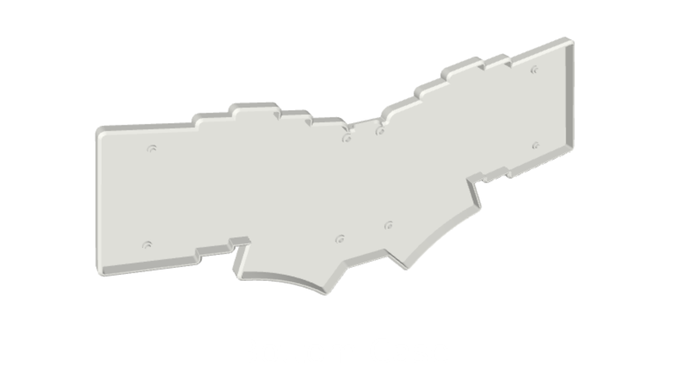
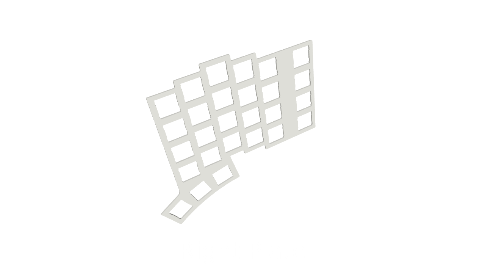

# 3D Files

The case is designed in Fusion 360 and the files are exported in STEP extension. 

For assembly we need 4xM2 screw inserts for the middle section of the case. The Component Cover needs redesign because it won't fit with the plates in place.

